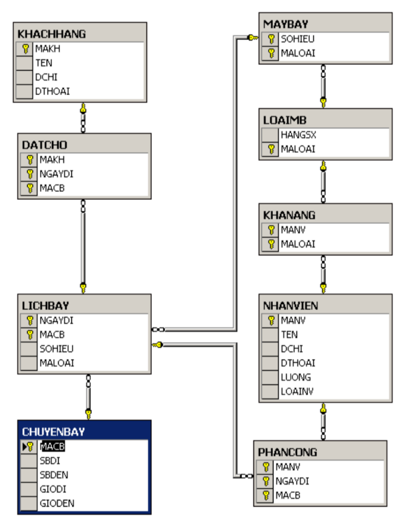

<center><h1>Bài tập SQL | Quản lý chuyến bay</h1><center>
- 
Microsoft SQL Server là một hệ quản trị cơ sở dữ liệu quan hệ được phát triển bởi Microsoft. Là một máy chủ cơ sở dữ liệu, nó là một sản phẩm phần mềm có chức năng chính là lưu trữ và truy xuất dữ liệu theo yêu cầu của các ứng dụng phần mềm khác.

Link dowload ==> https://go.microsoft.com/fwlink/?linkid=866662 <br>
Link mssql : =====> [Link dowload MSSQL or Sql Server](https://go.microsoft.com/fwlink/?linkid=866662)

# Mô tả cơ sở dữ liệu==>

- KHACHHANG(MAKH, TEN, DCHI, DTHOAI)
Mỗi khách hàng có một mã để phân biệt với những người khác, có tên, địa chỉ và số điện thoại đểliên lạc.

- NHANVIEN(MANV,TEN, DCHI, DTHOAI, LUONG, LOAINV)
Mỗi nhân viên của hãng hàng không có một tên, lương, địa chỉ, điện thoại và có một mã nhân viên duy nhất để phân biệt với các nhân viên khác. Nếu nhân viên là phi công thì giá trị thuộc tính LOAINV bằng 1, nếu nhân viên là tiếp viên thì giá trị LOAINV bằng 0.

- LOAIMB(MALOAI, HANGSX)
Mỗi loại máy bay có một mã loại để phân biệt với các loại máy bay khác và do một hãng sản xuất.

- MAYBAY(SOHIEU, MALOAI)
Mỗi máy bay có một số hiệu để phân biệt với các máy bay khác trong cùng một loại.

- CHUYENBAY(MACB, SBDI, SBDEN, GIODI, GIODEN)
Một chuyến bay có một mã chuyến bay để phân biệt với các chuyến bay khác. Mỗi chuyến bay xuất phát từ một sân bay (SBDI) và hạ cánh tại một sân bay khác (SBDEN); khởi hành vào một giờ (GIODI) và hạ cánh vào một giờ khác (GIODEN).

- LICHBAY(NGAYDI, MACB, SOHIEU, MALOAI)
Mỗi chuyến bay có thể có nhiều lịch bay. Mỗi lịch bay được xác định bởi một ngày khởi hành (NGAYDI) cụ thể và mã chuyến bay. Một lịch bay cụ thể chỉ sử dụng một máy bay. Giả sử mỗi chuyến bay chỉ được bố trí tối đa một lần cho một ngày.

- DATCHO(MAKH, NGAYDI, MACB)
Mỗi khách hàng có thể đặt chỗ theo lịch bay của hãng hàng không đưa ra. Giả sử mỗi khách hàng chỉ được phép đặt tối đa một chỗ trên một chuyến bay vào một ngày cụ thể.

- KHANANG(MANV, MALOAI)
Khả năng có thể lái loại máy bay của một phi công được biểu diễn bởi quan hệ KHANANG. Một phi công có thể biết lái nhiều loại máy bay khác nhau, và ngược lạI, mỗi loại máy bay có thể có nhiều phi công có khả năng lái.

- PHANCONG(MANV, NGAYDI, MACB)
Các nhân viên được phân công vào một hay nhiều lịch bay. Thường đối với phi công, họ phải được xphân công lái những loại máy bay phù hợp với khả năng
<p align="center">
  
</p>

# Tạo dữ liệu ban đầu==> 

```js
    // create database QL_ChuyenBay
    // go
    // use QL_ChuyenBay
```

|KHACHHANG|NHANVIEN|LOAIMB|MAYBAY|
|:---|---|---|---|
| Tạo bảng KHACHHANG    |Tạo bảng NHANVIEN              |Tạo bảng LOAIMB        |Tạo bảng MAYBAY                |
| **create table KHACHHANG**|**create table NHANVIEN**  |**create table LOAIMB**|**create table MAYBAY**        |
| (                     |(                              |(                      |(                              |
| MAKH nvarchar(15),    |MANV nvarchar(15),             |MALOAI nvarchar(15),   |SOHIEU int,                    |
| TEN nvarchar(15),     |TEN nvarchar(15),              |HANGSX nvarchar(15),   |MALOAI nvarchar(15),           |
| DCHI nvarchar(50),    |DCHI nvarchar(50),             |primary key (MALOAI)   |primary key (SOHIEU, MALOAI)   |
| DTHOAI nvarchar(12),  |DTHOAI nvarchar(12),           |)                      |)                              |
| primary key (MAKH)    |LUONG float,                   |                       |                               |
| )                     |LOAINV bit,                    |                       |                               |
|                       |primary key (MANV)             |                       |                               |
|                       |)                              |                       |                               |


|KHACHHANG|NHANVIEN|LOAIMB|MAYBAY|PHANCONG|
|:---|---|---|---|---:|
|Tạo bảng chuyến bay        |Tạo bảng LICHBAY               |Tạo bảng DATCHO                  |Tạo bảng KHANANG                |Tạo bảng PHANCONG|
|**create table CHUYENBAY** |**create table LICHBAY**       |**create table DATCHO**          |**create table KHANANG**        |**create table PHANCONG**|
| (                         |(                              |(                                |(                               |(
| MACB nvarchar(4),         |NGAYDI  datetime,              |MAKH nvarchar(15),               |MANV nvarchar(15),              |MANV nvarchar(15),
| SBDI nvarchar(3),         |MACB nvarchar(4),              |NGAYDI datetime,                 |MALOAI nvarchar(15),            |NGAYDI datetime,
| SBDEN nvarchar(3),        |DSOHIEU int,                   |MACB nvarchar(4),                |primary key (MANV, MALOAI)      |MACB nvarchar(4),
| GIODI time,               |MALOAI nvarchar(15),           |primary key(MAKH, NGAYDI, MACB)  |)                               |primary key (MANV, NGAYDI, MACB)
| GIODEN time,              |primary key (NGAYDI, MACB)     |)                                |                                |)
| )                         |)                              |                                 |                                |

# Reslove ==> 

    -- Tạo khóa ngoại cho bảng MAYBAY tham chiếu khóa chính của các table khác tham chiếu đến table LOAIMB
```css
    Alter table MAYBAY
    add constraint THUOC
    foreign key(MALOAI)
    references LOAIMB(MALOAI)
```
    -- Tạo khóa ngoại cho bảng LICHBAY tham chiếu đến khóa chính của các table khác tham chiếu MACB của table CHUYENBAY
  ```js
    // alter table LICHBAY
    // add constraint BAY
    // foreign key (MACB)
    // references CHUYENBAY(MACB)
    // --> Tham chiếu SOHIEU, MALOAI của table MAYBAY
    // alter table LICHBAY
    // add constraint DINHDANH
    // foreign key(SOHIEU, MALOAI)
    // references MAYBAY(SOHIEU, MALOAI)
  ```

    -- Tạo khóa ngoại cho table DATCHO tham chiếu đến khóa chính của các table khác tham chiếu MAKH của table KHACHHANG

```html
    // alter table DATCHO
    // add constraint DOITUONG
    // foreign key (MAKH)
    // references KHACHHANG(MAKH)
  ```
    -- Tham chiếu NGAYDI VÀ MACB của table LICHBAY
    alter table DATCHO
    add constraint PHUONGTIEN1
    foreign key (NGAYDI, MACB)
    references LICHBAY(NGAYDI, MACB)

* =>

        -- Tạo khóa ngoại cho tablr KHANANG
        -- Tham chiếu MANV của table NHANVIEN
        alter table KHANANG
        add constraint PHUCVU
        foreign key (MANV)
        references NHANVIEN(MANV)
        -- Tham chiếu MALOAI của table LOAIMB
        alter table KHANANG
        add constraint T
        foreign key (MALOAI)
        references LOAIMB(MALOAI)
        -- Tạo khóa ngoại cho table PHANCONG
        -- Tham chiếu MANV đến table NHANVIEN
        alter table PHANCONG
        add constraint NV
        foreign key (MANV)
        references NHANVIEN(MANV)
        --  Tham chiếu NGAYDI và MACB đến table LICHBAY
        alter table PHANCONG
        add constraint NV2
        foreign key( NGAYDI, MACB)
        references LICHBAY(NGAYDI, MACB)

## ==> Insert Data ==> Nhập dữ liệu cho tablE KHACHHANG

    insert into KHACHHANG values ('0009',  'Nga', '223 Nguyen Trai', '8932220')
    insert into KHACHHANG values ('0101',  'Anh', '567 Tran Phu', '8826729')
    insert into KHACHHANG values ('0045',  'Thu', '285 Le Loi', '8932203')
    insert into KHACHHANG values ('0012',  'Ha', '435 Quang Trung', '8933232')
    insert into KHACHHANG values ('0238',  'Hung', '456 Pasteur', '9812101')
    insert into KHACHHANG values ('0397',  'Thanh', '234 Le Van Sy', '8952943')
    insert into KHACHHANG values ('0582',  'Mai', '789 Nguyen Du', null)
    insert into KHACHHANG values ('0934',  'Minh', '678 Le Lai', null)
    insert into KHACHHANG values ('0091',  'Hai', '345 Hung Vuong', '8893223')
    insert into KHACHHANG values ('0314',  'Phuong', '385 Vo Van Tuan', '8232320')
    insert into KHACHHANG values ('0613',  'Vu', '348 CMT8', '8343232')
    insert into KHACHHANG values ('0586',  'Son', '123 Bach Dang', '8556223')
    insert into KHACHHANG values ('0422',  'Tien', '75 Nguyen Thong', '8332222')

### --Nhập dữ liệu cho table CHUYENBAY
    insert into CHUYENBAY values ('100', 'SLC', 'BOS', '08:00','17:59' )
    insert into CHUYENBAY values ('112', 'DCA', 'DEN', '14:00','18:07' )
    insert into CHUYENBAY values ('121', 'STL', 'SLC', '07:00','9:13' )
    insert into CHUYENBAY values ('122', 'STL', 'YYV', '08:30','10:19' )
    insert into CHUYENBAY values ('206', 'DFW', 'STL', '09:00','11:40' )
    insert into CHUYENBAY values ('330', 'JFK', 'YYV', '16:00','18:53' )
    insert into CHUYENBAY values ('334', 'ORD', 'MIA', '12:00','14:14' )
    insert into CHUYENBAY values ('335', 'MIA', 'ORD', '15:00','17:14' )
    insert into CHUYENBAY values ('336', 'ORD', 'MIA', '18:00','20:14' )
    insert into CHUYENBAY values ('337', 'MIA', 'ORD', '20:30','23:53' )
    insert into CHUYENBAY values ('394', 'DFW', 'MIA', '19:00','21:30' )
    insert into CHUYENBAY values ('395', 'MIA', 'DFW', '21:00','23:43' )
    insert into CHUYENBAY values ('449', 'CDG', 'DEN', '10:00','19:29' )
    insert into CHUYENBAY values ('930', 'YYV', 'DCA', '13:00','16:10' )
    insert into CHUYENBAY values ('931', 'DCA', 'YYV', '17:00','18:10' )
    insert into CHUYENBAY values ('932', 'DCA', 'YYV', '18:00','19:10' )
    insert into CHUYENBAY values ('991', 'BOS', 'ORD', '17:00','18:22' )
###  -- Nhập dữ liệu cho table LOAIMB
    insert into LOAIMB values  ('A310','Airbus')
    insert into LOAIMB values ('A320', 'Airbus')
    insert into LOAIMB values ('A330', 'Airbus')
    insert into LOAIMB values ('A340', 'Airbus')
    insert into LOAIMB values ('B727', 'Boeing')
    insert into LOAIMB values ('B747', 'Boeing')
    insert into LOAIMB values ('B757', 'Boeing')
    insert into LOAIMB values ('DC10', 'MD')
    insert into LOAIMB values ('DC9', 'MD')
###  -- Nhập dữ liệu cho table NHANVIEN
    insert into NHANVIEN values ('1006', 'Chi', '12/6  Nguyen Kiem', '8120022', 150000, 0)
    insert into NHANVIEN values ('1005', 'Giao', '65 Nguyen Thai Son', '8324467', 500000, 0)
    insert into NHANVIEN values ('1001', 'Huong', '8 Dien Bien Phu', '8330733', 500000, 1)
    insert into NHANVIEN values ('1002', 'Phong', '1 Ly Thuong Kiet', '8308117', 150000, 1)
    insert into NHANVIEN values ('1004', 'Phuong', '351 Lac Long Quan', '8308155', 250000, 0)
    insert into NHANVIEN values ('1003', 'Quang', '78 Truong Dinh', '8324461', 350000, 1)
    insert into NHANVIEN values ('1007', 'Tam', '36 Nguyen Van Cu', '8458188', 500000, 0)
  
###  -- Nhập dữ liệu cho table KHANANG
    insert into KHANANG values ('1001', 'B727')
    insert into KHANANG values ('1001', 'B747')
    insert into KHANANG values ('1001', 'DC10')
    insert into KHANANG values ('1001', 'DC9')
    insert into KHANANG values ('1002', 'A320')
    insert into KHANANG values ('1002', 'A340')
    insert into KHANANG values ('1002', 'B757')
    insert into KHANANG values ('1002', 'DC9')
    insert into KHANANG values ('1003', 'A310')
    insert into KHANANG values ('1003', 'DC9')
###  -- Nhập dữ liệu cho table MAYBAY
    insert into MAYBAY VALUES (10, 'B747')
    insert into MAYBAY VALUES (11, 'B727')
    insert into MAYBAY VALUES (13, 'B727')
    insert into MAYBAY VALUES (13, 'B747')
    insert into MAYBAY VALUES (21, 'DC10')
    insert into MAYBAY VALUES (21, 'DC9')
    insert into MAYBAY VALUES (22, 'B757')
    insert into MAYBAY VALUES (22, 'DC9')
    insert into MAYBAY VALUES (23, 'DC9')
    insert into MAYBAY VALUES (24, 'DC9')
    insert into MAYBAY VALUES (70, 'A310')
    insert into MAYBAY VALUES (80, 'A310')
    insert into MAYBAY VALUES (93, 'B757')
  
###  -- Nhập dữ liệu cho table LICHBAY 
    insert into LICHBAY values ('11/01/2000', '100', 80, 'A310')
    insert into LICHBAY values ('11/01/2000', '112', 21, 'DC10')
    insert into LICHBAY values ('11/01/2000', '206', 22, 'DC9')
    insert into LICHBAY values ('11/01/2000', '334', 10, 'B747')
    insert into LICHBAY values ('11/01/2000', '395', 23, 'DC9')
    insert into LICHBAY values ('11/01/2000', '991', 22, 'B757')
    insert into LICHBAY values ('11/01/2000', '337', 10, 'B747')
    insert into LICHBAY values ('10/31/2000', '100', 11, 'B727')
    insert into LICHBAY values ('10/31/2000', '112', 11, 'B727')
    insert into LICHBAY values ('10/31/2000', '206', 13, 'B727')
    insert into LICHBAY values ('10/31/2000', '334', 10, 'B747')
    insert into LICHBAY values ('10/31/2000', '335', 10, 'B747')
    insert into LICHBAY values ('10/31/2000', '337', 24, 'DC9')
    insert into LICHBAY values ('10/31/2000', '449', 70, 'A310')
###  -- Nhập dữ liệu cho table DATCHO
    insert  into DATCHO values ('0009', '11/01/2000', 100)
    insert  into DATCHO values ('0009', '10/31/2000', 449)
    insert  into DATCHO values ('0045', '11/01/2000', 991)
    insert  into DATCHO values ('0012', '10/31/2000', 206)
    insert  into DATCHO values ('0238', '10/31/2000', 334)
    insert  into DATCHO values ('0582', '11/01/2000', 991)
    insert  into DATCHO values ('0091', '11/01/2000', 100)
    insert  into DATCHO values ('0314', '10/31/2000', 449)
    insert  into DATCHO values ('0613', '11/01/2000', 100)
    insert  into DATCHO values ('0586', '11/01/2000', 991)
    insert  into DATCHO values ('0586', '10/31/2000', 100)
    insert  into DATCHO values ('0422', '10/31/2000', 449)
###  -- Nhập dữ liệu cho table PHANCONG
    insert into PHANCONG  values ('1001', '11/01/2000', '100')
    insert into PHANCONG  values ('1001', '10/31/2000', '100')
    insert into PHANCONG  values ('1002', '11/01/2000', '100')
    insert into PHANCONG  values ('1002', '10/31/2000', '100')
    insert into PHANCONG  values ('1003', '10/31/2000', '100')
    insert into PHANCONG  values ('1003', '10/31/2000', '337')
    insert into PHANCONG  values ('1004', '10/31/2000', '100')
    insert into PHANCONG  values ('1004', '10/31/2000', '337')
    insert into PHANCONG  values ('1005', '10/31/2000', '337')
    insert into PHANCONG  values ('1006', '11/01/2000', '991')
    insert into PHANCONG  values ('1006', '10/31/2000', '337')
    insert into PHANCONG  values ('1007', '11/01/2000', '112')
    insert into PHANCONG  values ('1007', '11/01/2000', '991')
    insert into PHANCONG  values ('1007', '10/31/2000', '206')

<center>Start - End<center>
-
    -- 1, Cho biết mã số tên phi công, địa chỉ,  điện thoại của các phi công đã từng lái máy bay 747
    select NV.MANV,NV.TEN, NV.DCHI, NV.DTHOAI
    FROM NHANVIEN NV, LICHBAY LB, PHANCONG PC
    where LB.MALOAI = 'B747' and PC.MACB = LB.MACB AND PC.NGAYDI = LB.NGAYDI and PC.MANV = NV.MANV

    -- 2, Cho biết mã số và ngày đi của các chuyến bay xuất phát từ sân bay DCA trong khoảng thời gian từ 14h - 18h
    select CB.MACB, LB.NGAYDI
    from CHUYENBAY CB, LICHBAY LB
    where (SBDI = 'DCA' and (GIODI between '14:00' and '18:00') and ( CB.MACB = LB.MACB))


    -- 3, Cho biết những nhân viên được phân công trên chuyến bay có mã số 100 xuất phát tại sân bay SLC. các dòng chữ xuất ra không được phép
    -- trùng lắp

    select DISTINCT NV.TEN
    from CHUYENBAY CB, NHANVIEN NV, PHANCONG PC, LICHBAY LB
    where ((CB.MACB = '100') and (SBDI = 'SLC') and PC.MACB = CB.MACB AND LB.MACB = CB.MACB and PC.NGAYDI = LB.NGAYDI AND NV.MANV = PC.MANV)


    -- 4,Cho biết mã loại và số hiệu máy bay đã từng xuất phát tại sân bay MIA. các dòng chữ xuất ra không được trùng lắp
    select DISTINCT MALOAI, SOHIEU
    FROM LICHBAY LB, CHUYENBAY CB
    where ((CB.SBDI = 'MIA') and (LB.MACB = CB.MACB))

    -- 5, Cho biết mã chuyến bay, ngày đi, cùng với tên, địa chỉ, điện thoại, của tất cả các hành khách đi trên chuyến bay đó, sắp xếp theo thứ
    -- tự tăng dần của mã chuyến bay và giảm dần theo ngày đi

    select DISTINCT LB.MACB, LB.NGAYDI,TEN, DCHI, DTHOAI
    from LICHBAY LB, KHACHHANG KH, DATCHO DT, CHUYENBAY CB
    where (DT.MAKH = KH.MAKH and DT.MACB = LB.MACB and LB.NGAYDI = DT.NGAYDI and CB.MACB = LB.MACB)
    order by LB.MACB ASC, LB.NGAYDI DESC


    --6, Cho biết mã chuyến bay, ngày đi, mã số và tên, địa chỉ điện thoại của tất cả những nhân viên được phân công trên chuyến bay đó.
    --tự tăng dần của mã chuyến bay và giảm dần theo ngày đi
        select MACB, NGAYDI, NV.MANV, NV.TEN, DCHI, DTHOAI
        FROM NHANVIEN NV, PHANCONG PC
        WHERE NV.MANV = PC.MANV
        order by PC.MACB ASC, PC.NGAYDI DESC
    -- 7, Cho biết mã chuyến bay, ngày đi, mã số và tên của những phi công  được phân vào chuyến bay hạ cánh xuống sân bay ORĐ

    select CB.MACB, LB.NGAYDI, NV.MANV, TEN
    from CHUYENBAY CB, NHANVIEN NV, PHANCONG PC, LICHBAY LB
    where (CB.MACB = PC.MACB and PC.NGAYDI = LB.NGAYDI and NV.MANV = PC.MANV and CB.SBDEN = 'ORD' and LB.MACB = CB.MACB)


    -- 8, Cho biết các chuyến bay (mã số chuyến bay, ngày đi và tên của phi công) trong đó phi công có mã số 1001 được phân công lái.
    select  PC.MACB, NGAYDI, TEN
    from NHANVIEN NV, PHANCONG PC
    where (NV.MANV = '1001' and NV.MANV = PC.MANV)

    -- 9, Cho biết thông tin(mã chuyến bay, sân bay đi, giờ đi, giờ đến, ngày đi) của những chuyến bay hạ cánh xuống DEN. Các chuyến bay được
    -- liệt kê theo ngày giảm dần, và sân bay xuất phát tăng dần
    select CB.MACB, SBDI, GIODI, GIODEN, NGAYDI
    from CHUYENBAY CB, LICHBAY LB
    where (CB.SBDEN = 'DEN' and CB.MACB = LB.MACB )
    order by NGAYDI DESC, SBDI ASC

    -- 10, Với mỗi phi công, cho biết hãng sản xuất và mã loại máy bay mà phi công này có khả năng lái. Xuất tên phi công, hãng sản xuất và MALOAI
    select TEN, HANGSX, LMB.MALOAI
    from KHANANG KN, NHANVIEN NV, LOAIMB LMB
    where( NV.MANV = KN.MANV and KN.MALOAI = LMB.MALOAI)


    -- 11, Cho biết mã phi công, tên phi công đã lái máy bay trong chuyến bay mã số 100, và ngày 11/1/2000
    select NV.MANV, TEN
    from NHANVIEN NV, PHANCONG PC, LICHBAY LB
    where (LB.MACB = '100' and  LB.NGAYDI = '11/01/2000' AND LB.MACB = PC.MACB AND NV.MANV = PC.MANV AND PC.NGAYDI = LB.NGAYDI)


    --12, Cho biết mã chuyến bay, mã nhân viên, tên nhân viên được phân công  vào chuyến bay xuất phát ngày 10/31/2000. tại sân bay MIA vào
    -- lúc 20h30
    select PC.MACB, NV.MANV, TEN
    from NHANVIEN NV, PHANCONG PC, CHUYENBAY CB, LICHBAY LB
    where(CB.SBDI = 'MIA' and CB.GIODI = '20:30' and LB.NGAYDI ='10/31/2000' and LB.MACB = LB.MACB and PC.NGAYDI = LB.NGAYDI and PC.MACB = LB.MACB and PC.MANV = NV.MANV and LB.MACB = CB.MACB)

    -- 13, Cho biết thông tin về chuyến bay mà phi công Quang đã lái(mã chuyến bay, số hiệu, mã loại, hãng sản xuất, )
        select PC.MACB, SOHIEU, LMB.MALOAI, LMB.HANGSX
        from NHANVIEN NV, PHANCONG PC, LOAIMB LMB, LICHBAY LB, CHUYENBAY CB
        where NV.MANV = PC.MANV and NV.TEN = 'Quang' and LB.MACB = PC.MACB and LB.MALOAI = LMB.MALOAI and LB.NGAYDI = PC.NGAYDI and LB.MACB = CB.MACB

##############################################################################################

    -- 14, Cho biết những phi công chưa được phân công chuyến bay nào
    
    select TEN
    from NHANVIEN 
    where (MANV NOT IN (select PC.MANV FROM PHANCONG PC))
    

    -- 15,Cho biết tên những khách hàng đã đi chuyến bay trên máy bay của hãng BOEING
    select DISTINCT TEN
    FROM KHACHHANG KH, LOAIMB LMB, LICHBAY LB, DATCHO DC, CHUYENBAY CB
    where (LMB.HANGSX = 'Boeing' and LB.MALOAI = LMB.MALOAI and DC.MAKH = KH.MAKH and DC.MACB = LB.MACB and DC.NGAYDI = LB.NGAYDI and CB.MACB = LB.MACB )


    -- Cho biết mã các chuyến bay chỉ bay với số hiệu là 10 và mã loại b747
    select DISTINCT MACB
    from LICHBAY LB
    where (LB.SOHIEU = 10 and LB.MALOAI = 'B747')

    -- Câu 17: với mỗi sân bay(SBDEN), cho biết số lượng chuyến bay hạ cánh xuống sân bay đó. Kêt quả được sắp xếp theo thứ tự tăng dần của
    -- số chuyến bay đến.
    select SBDEN, COUNT(*) AS SOLUONG
    FROM CHUYENBAY CB
    GROUP BY SBDEN 
    ORDER BY SOLUONG ASC
    -- Câu 18: Với mỗi sân bay đi(SBDI), cho biết số lượng sân bay xuất phát từ sân bay đó  , sắp xếp theo thứ tự tăng dần của chuyến bay xuất 
    -- phát
    select SBDI, COUNT(*) AS SOLUONG
    FROM CHUYENBAY CB
    GROUP BY SBDI
    ORDER BY SOLUONG ASC
    -- Câu 19: Với mỗi sân bay(SBDI), cho biết số lượng chuyến bay xuất phát theo từng ngày. Xuất ra mã sân bay, ngày và số lượng
    select SBDI, NGAYDI, COUNT(*) AS SOLUONG
    FROM CHUYENBAY CB, LICHBAY LB
    WHERE CB.MACB = LB.MACB
    GROUP BY SBDI, NGAYDI
    -- Câu 20: Với mỗi sân bay đến(SBDEN), cho biết số lượng chuyến bay hạ cánh theo từng ngày. Xuất ra mã  sân bay đến, ngày và số lượng.
    select SBDEN, NGAYDI, COUNT(*) AS SOLUONG
    FROM CHUYENBAY CB, LICHBAY LB
    WHERE CB.MACB = LB.MACB
    GROUP BY SBDEN, NGAYDI
    -- Câu 21: Với mỗi lịch bay, cho biết mã chuyến bay, ngày đi, cùng số lượng nhân viên không phải là phi công của chuyến bay đó
    select LB.MACB, LB.NGAYDI,COUNT(PC.MANV) AS SOLUONGNHANVIENKHONGTHAMGIA
    FROM LICHBAY LB, PHANCONG PC, NHANVIEN NV
    WHERE PC.NGAYDI = LB.NGAYDI AND PC.MACB = LB.MACB AND PC.MANV = NV.MANV AND NV.LOAINV = 0
    GROUP BY LB.MACB, LB.NGAYDI
    -- Câu 22: Số lượng chuyến bay xuất phát từ sân bay MIA vào ngày 11/01/2000
    SELECT COUNT(*) SOLUONG
    FROM CHUYENBAY CB, LICHBAY LB
    WHERE CB.SBDI = 'MIA' AND LB.NGAYDI = '11/01/2000' AND LB.MACB = CB.MACB
    -- Câu 23; Với mỗi chuyến bay cho biết mã chuyến bay, ngày đi, số lượng nhân viên được phân công trên chuyến bay đó, sắp theo thứ tự 
    -- giảm dần số lượng
    SELECT LB.MACB, LB.NGAYDI, COUNT(*) SOLUONGNHANVIENTHAMGIA
    FROM LICHBAY LB, NHANVIEN NV, PHANCONG PC
    WHERE PC.MACB = LB.MACB AND PC.NGAYDI = LB.NGAYDI AND PC.MANV = NV.MANV
    GROUP BY LB.MACB, LB.NGAYDI
    -- Câu 24: Với mỗi chuyến bay, cho biết mã chuyến bay, ngày đi, cùng với số lượng hành khách đã đặt chỗ của chuyến bay đó, sắp xếp theo thứ
    -- tự giảm dần của số lượng
    SELECT DC.MACB, DC.NGAYDI, COUNT(*) AS SOLUONGHANHKHACH
    FROM LICHBAY LB, DATCHO DC, KHACHHANG KH
    WHERE DC.MACB = LB.MACB AND DC.NGAYDI = LB.NGAYDI AND DC.MAKH = KH.MAKH
    GROUP BY DC.MACB, DC.NGAYDI
    ORDER BY SOLUONGHANHKHACH DESC
    -- Câu 25: Với mỗi chuyến bay, cho biết mã chuyến bay, ngày đi, tổng lương của phi hành đoàn. sắp tăng dần tổng lương
    SELECT PC.MACB, PC.NGAYDI, SUM(LUONG) AS TONGLUONG
    FROM LICHBAY LB, NHANVIEN NV, PHANCONG PC
    WHERE LB.NGAYDI = PC.NGAYDI AND LB.MACB = PC.MACB 
    GROUP BY PC.MACB, PC.NGAYDI
    -- 26: Cho biết lương trung bình của các nhân viên không là phi công
    SELECT AVG(LUONG) AS LUONGTRUNGBINHCUANHANVIEN
    FROM NHANVIEN NV
    WHERE NV.LOAINV = 0
    -- 27: Cho biết mức lương trung bình của các phi công
    SELECT AVG(LUONG) AS LUONGTRUNGBINHCUAPHICONG
    FROM NHANVIEN NV
    WHERE NV.LOAINV = 1
    -- 28: Với mỗi loại máy bay, cho biết số lượng chuyến bay đã bay trên loại máy bay đó hạ cánh xuống sân bay ORD/ Xuất mã loại máy bay và
    -- số lượng chuyến bay.
    SELECT LB.MALOAI, COUNT(*) SOLUONGCHUYENBAY
    FROM CHUYENBAY CB, LICHBAY LB
    WHERE LB.MACB = CB.MACB AND CB.SBDEN = 'ORD'
    GROUP BY LB.MALOAI 
    -- Câu 29: Cho biết sân bay(SBDI) và số lượng chuyến bay có nhiều hơn 2 chuyến bay xuất phát trong khoảng 10h đến 22h
    SELECT SBDI, COUNT(*) SOLUONG
    FROM CHUYENBAY CB
    WHERE GIODI BETWEEN '10:00' AND '22:00'
    GROUP BY SBDI
    HAVING COUNT(*) > 2
    -- Câu 30: Cho biết tên phi công đã được phân công vào ít nhất 2 chuyến bay trong cùng một ngày
    SELECT NV.TEN
    FROM PHANCONG PC, NHANVIEN NV
    WHERE PC.MANV = NV.MANV AND NV.LOAINV = 1
    GROUP BY NV.TEN
    HAVING COUNT(*) > 2
    -- Câu 31: Cho biết mã chuyến bay và ngày đi của những chuyến bay có ít hơn 3 hành khách đặt chỗ
    SELECT DC.MACB, DC.NGAYDI
    FROM LICHBAY LB, DATCHO DC
    WHERE LB.NGAYDI = DC.NGAYDI AND LB.MALOAI = DC.MACB 
    GROUP BY DC.NGAYDI, DC.MACB
    HAVING COUNT(DC.MAKH) > 3
    -- Câu 32: Cho biết số hiệu máy bay và loại máy bay mà phi công có mã 1001 được phân lái trên 2 lần
    SELECT SOHIEU, LB.MALOAI
    FROM PHANCONG PC, LICHBAY LB
    WHERE PC.MANV = '1001' AND PC.MACB = LB.MACB AND PC.NGAYDI = LB.NGAYDI
    GROUP BY LB.SOHIEU, LB.MALOAI
    HAVING COUNT(*) >2
    -- Câu 33: Với mỗi hãng sản xuất, cho biết số lượng loại máy bay mà hãng đó sản xuất. Xuất ra hãng sản xuất và số lượng.
    SELECT HANGSX, COUNT(LMB.MALOAI) AS SOLUONGMAYBAY
    FROM LOAIMB LMB, MAYBAY MB
    WHERE LMB.MALOAI = MB.MALOAI
    GROUP BY HANGSX
    -- Câu 34: Cho biết hãng sản xuất, mã loại và số hiệu của máy bay được sử dụng nhiều nhất
    SELECT HANGSX, LMB.MALOAI, LB.SOHIEU
    FROM LOAIMB LMB, LICHBAY LB
    WHERE LMB.MALOAI = LB.MALOAI 
    GROUP BY HANGSX, LMB.MALOAI, LB.SOHIEU
    HAVING COUNT(LB.SOHIEU) >= ALL(SELECT COUNT(*)
                    FROM LICHBAY LB2 
                    GROUP BY LB2.MALOAI, LB2.SOHIEU
                    )
    -- Câu 35: Cho biết tên nhân viên được phân công đi nhiều chuyến bay nhất
    SELECT NV.TEN
    FROM NHANVIEN NV, PHANCONG PC
    WHERE NV.MANV = PC.MANV AND NV.LOAINV = 0
    GROUP BY NV.TEN
    HAVING COUNT(NV.MANV) >= ALL (SELECT COUNT(*) 
                FROM PHANCONG PC, NHANVIEN NV
                WHERE NV.MANV = PC.MANV AND NV.LOAINV = 0
                GROUP BY PC.MANV)                  
    -- Câu 36: Cho biết thông tin của phi công(Tên, địa chỉ, điện thoại) lái nhiều chuyến bay nhất
    SELECT NV.TEN, NV.DCHI, NV.DTHOAI
    FROM NHANVIEN NV, PHANCONG PC
    WHERE PC.MANV = NV.MANV AND NV.LOAINV = 1
    GROUP BY NV.TEN, NV.DCHI, NV.DTHOAI
    HAVING COUNT(*) >= ALL (SELECT COUNT(*)
                FROM PHANCONG PC, NHANVIEN NV
                WHERE PC.MANV = NV.MANV AND NV.LOAINV = 1
                GROUP BY PC.MANV)
    -- Câu 37: Cho biết sân bay(SBDEN) và số lượng chuyến bay của sân bay có ít chuyến bay đáp xuống nhất
    SELECT SBDEN, COUNT(*) SOLUONGCHUYENBAYDAP
    FROM CHUYENBAY CB
    GROUP BY CB.SBDEN
    HAVING COUNT(*) <= ALL (SELECT COUNT(*)
                FROM CHUYENBAY CB
                GROUP BY CB.SBDEN)
    -- Câu 38: Cho biết sân bay(SBDI) và số lượng chuyến bay của sân bay có nhiều chuyến bay xuất phát nhất
    SELECT SBDI, COUNT(*) SOLUONGCHUYENBAYCATCANH
    FROM CHUYENBAY CB
    GROUP BY CB.SBDI
    HAVING COUNT(*) >= ALL (SELECT COUNT(*) 
                FROM CHUYENBAY CB
                GROUP BY CB.SBDI)
    -- Câu 39: Cho biết tên, địa chỉ, điện thoại của khách hàng đã đi trên nhiều chuyến bay nhất
    SELECT TEN, DCHI, DTHOAI
    FROM KHACHHANG KH, DATCHO DC
    WHERE KH.MAKH = DC.MAKH
    GROUP BY DC.MAKH
    HAVING COUNT(*) >= ALL (SELECT COUNT(*)
                FROM DATCHO DC
                GROUP BY DC.MAKH)
    -- Câu 40: Cho biết mã số, tên, lương của các phi công có khả năng lái nhiều máy bay nhất
    SELECT KN.MANV, TEN, LUONG
    FROM NHANVIEN NV, KHANANG KN
    WHERE NV.MANV = KN.MANV
    GROUP BY KN.MANV 
    HAVING COUNT(*) >= ALL (SELECT COUNT(*)
                FROM KHANANG KN
                GROUP BY KN.MANV)
        
    -- Câu 41: Cho biết thông tin của nhân viên(mã, tên, lương) của nhân viên có lương cao nhất
    SELECT MANV, TEN, LUONG
    FROM NHANVIEN 
    WHERE LUONG = (SELECT MAX(LUONG)
            FROM NHANVIEN)
    -- Câu 42: Cho biết tên, địa chỉ, của các nhân viên LƯƠNG cao nhất trong phi hành đoàn(các nhân viên được phân công trong 1 chuyến bay mà
    -- người đó tham gia
    SELECT TEN, DCHI
    FROM NHANVIEN NV
    WHERE EXISTS (  SELECT *
            FROM PHANCONG PC,  NHANVIEN NV1
            WHERE NV1.MANV = PC.MANV
            GROUP BY MACB, NGAYDI
            HAVING NV.LUONG IN(SELECT MAX(NV1.LUONG) 
                        FROM PHANCONG PC,  NHANVIEN NV1
                        WHERE NV1.MANV = PC.MANV
                        GROUP BY MACB, NGAYDI
                        )
            )

    -- Câu 43: Cho biết mã chuyến bay, giờ đi, giờ đến của chuyến bay sớm nhất trong ngày
    SELECT CB.MACB, LB.NGAYDI, CB.GIODI, CB.GIODEN
    FROM LICHBAY LB, CHUYENBAY CB
    WHERE LB.MACB = CB.MACB AND EXISTS (

                        SELECT*
                        FROM LICHBAY LB1, CHUYENBAY CB1
                        WHERE LB1.MACB = CB1.MACB AND LB.NGAYDI = LB1.NGAYDI
                        GROUP BY LB1.NGAYDI
                        HAVING CB.GIODI = MIN(CB1.GIODI)
                        )

    -- Câu 44: Cho biết mã chuyến bay có thời gian bay dài nhất. Xuất ma ra mã chuyến bay và thời gian bay(tính bằng phút)
    SELECT CB.MACB, DATEDIFF(MI, CB.GIODI, CB.GIODEN)
    FROM CHUYENBAY CB
    WHERE DATEDIFF(MI, CB.GIODI, CB.GIODEN) >= ALL (SELECT DATEDIFF(MI, CB.GIODI, CB.GIODEN) 
                            FROM CHUYENBAY CB)
    -- Câu 45: Cho biết mã chuyến bay có thời gian bay ít nhất. Xuất ra mã chuyến bay và thời gian bay
    SELECT CB.MACB, DATEDIFF(MI, CB.GIODI, CB.GIODEN)
    FROM CHUYENBAY CB
    WHERE DATEDIFF(MI, CB.GIODI, CB.GIODEN) <= ALL (SELECT DATEDIFF(MI, CB.GIODI, CB.GIODEN) 
                            FROM CHUYENBAY CB)
    -- Câu 46: Cho biết mã chuyến bay, ngày đi của của những chuyến bay trên loại máy bay B747 nhiều nhất
    SELECT MACB, NGAYDI
    FROM LICHBAY LB
    WHERE EXISTS(
        SELECT *
        FROM LICHBAY LB1
        WHERE LB1.MALOAI = 'B747' AND LB1.MACB = LB.MACB
        GROUP BY MACB
        HAVING COUNT(LB1.NGAYDI) >= ALL (SELECT COUNT(LB2.NGAYDI)
                    FROM LICHBAY LB2
                    WHERE LB2.MALOAI = 'B747'
                    GROUP BY MACB
                    )
                    )
    -- Câu 47: Với mỗi chuyến bay có trên 3 hành khách, cho biết mã chuyến bay và số lượng nhân viên trên chuyến bay đó. Xuất ra mã chuyến bay
    -- số lượng nhân viên
    SELECT LB.MACB, COUNT(DISTINCT PC.MANV) SOLUONGNHANVIEN
    FROM DATCHO DC, PHANCONG PC, LICHBAY LB
    WHERE DC.MACB = LB.MACB AND DC.NGAYDI = LB.NGAYDI AND PC.NGAYDI = LB.NGAYDI AND PC.MACB = LB.MACB
    GROUP BY LB.MACB, LB.NGAYDI
    HAVING COUNT(DISTINCT DC.MAKH) > 2
    
    -- 48: Với mỗi loại nhân viên có tổng lương  trên 600000, cho biết số lượng nhân viên trong từng loại nhân viên đó. xuất loại nhân viên,
    -- số lượng nhân viên tương ứng
    SELECT LOAINV, COUNT(MANV)
    FROM NHANVIEN NV
    GROUP BY LOAINV
    HAVING SUM(NV.LUONG) > 600000
    -- Câu 49: Với mỗi chuyến bay có trên 3 nhân viên, cho biết mã chuyến bay, và số lượng khách hàng đã đặt chỗ trên chuyến bay đó.
    SELECT LB.MACB, COUNT(DISTINCT DC.MAKH) SOLUONGKHACH
    FROM DATCHO DC, PHANCONG PC, LICHBAY LB
    WHERE DC.MACB = LB.MACB AND DC.NGAYDI = LB.NGAYDI AND PC.NGAYDI = LB.NGAYDI AND PC.MACB = LB.MACB
    GROUP BY LB.MACB, LB.NGAYDI
    HAVING COUNT(DISTINCT PC.MANV) > 1
    -- Câu 50:Với mỗi loại máy bay có nhiều hơn 1 chiếc, cho biết số lượng chuyến bay đã được bố trí bay bằng loại máy bay đó, xuất ra mã loạivà
    -- số lượng
    SELECT LB.MALOAI, COUNT(*) SOLUONGCHUYENBAY
    FROM LICHBAY LB
    WHERE LB.MALOAI IN (SELECT MALOAI
                FROM MAYBAY MB
                GROUP BY MALOAI
                HAVING COUNT(*) > 1)
    GROUP BY LB.MALOAI

<center><h1 style = "color: red">Ok Bye!!!</h1><center>